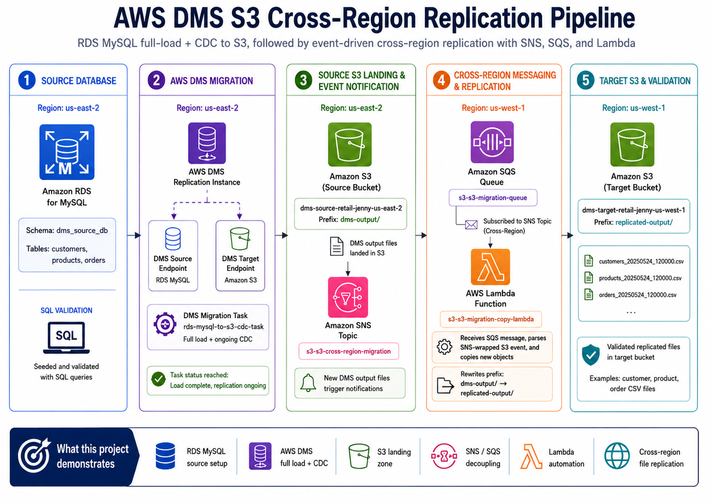

# AWS DMS S3 Cross-Region Replication Pipeline

This project demonstrates a data migration and replication workflow using Amazon RDS for MySQL, AWS Database Migration Service (DMS), Amazon S3, Amazon SNS, Amazon SQS, and AWS Lambda.

The pipeline starts with a MySQL source database in `us-east-2`. AWS DMS performs a full load and ongoing change data capture (CDC) into a source S3 bucket. When new DMS output files land in S3, an event-driven flow sends the object event through SNS and SQS. A Lambda function then copies the new object into a target S3 bucket in `us-west-1`.

## Architecture



## What This Project Demonstrates

- RDS MySQL source database setup
- AWS DMS full load and ongoing CDC replication
- S3 landing zone for database migration output
- S3 event notifications routed through SNS
- Cross-region SQS subscription and Lambda processing
- Lambda-based S3 object copy from source region to target region
- Troubleshooting DMS schema mapping, endpoint validation, IAM, and event triggers
- Cost-conscious cleanup after testing

## Business Use Case

Companies often need to move operational database data into object storage for backup, analytics, disaster recovery, or downstream processing.

This project models a simple version of that pattern:

1. A transactional MySQL database contains retail data.
2. AWS DMS extracts the existing data and captures ongoing changes.
3. DMS writes output files into Amazon S3.
4. New S3 files trigger an event-driven replication workflow.
5. Lambda copies the files into a target-region S3 bucket.

This creates a simple cross-region data replication pattern without manually copying files.

## Data Flow

```text
Amazon RDS MySQL
    ↓
AWS DMS full load + CDC task
    ↓
Source S3 bucket: dms-output/
    ↓
S3 object-created event
    ↓
Amazon SNS topic
    ↓
Amazon SQS queue
    ↓
AWS Lambda copy function
    ↓
Target S3 bucket: replicated-output/
```

## Regions Used

| Layer | Region |
|---|---|
| Source RDS MySQL database | `us-east-2` |
| AWS DMS replication task | `us-east-2` |
| Source S3 bucket | `us-east-2` |
| SNS topic | `us-east-2` |
| SQS queue | `us-west-1` |
| Lambda copy function | `us-west-1` |
| Target S3 bucket | `us-west-1` |

## AWS Services Used

| Service | Purpose |
|---|---|
| Amazon RDS for MySQL | Source database containing retail tables |
| AWS DMS | Migrated full-load and CDC data from MySQL to S3 |
| Amazon S3 | Stored DMS output files and replicated target files |
| Amazon SNS | Received object-created notifications from the source S3 bucket |
| Amazon SQS | Buffered SNS messages before Lambda processing |
| AWS Lambda | Parsed SQS/SNS/S3 event messages and copied new objects to the target bucket |
| IAM | Provided service permissions for DMS, Lambda, S3, SNS, and SQS |
| CloudWatch Logs | Supported Lambda and DMS troubleshooting |

## Source Database

The source database used a small retail-style schema:

- `customers`
- `products`
- `orders`

The seed SQL creates the source schema, inserts test records, and includes validation queries.

See:

```text
aws/sql/seed_source_database.sql
```

## Lambda Function

The Lambda function receives messages from SQS.

Each SQS message contains an SNS message. The SNS message contains the original S3 object-created event.

The function:

1. Reads the SQS message.
2. Parses the SNS-wrapped S3 event.
3. Gets the source bucket and object key.
4. Rewrites the object prefix from `dms-output/` to `replicated-output/`.
5. Copies the object into the target S3 bucket.

See:

```text
aws/lambda/copy_s3_object_from_sqs.py
```

## Important Paths

| Purpose | Path |
|---|---|
| Source S3 bucket | `s3://dms-source-retail-jenny-us-east-2/` |
| DMS output prefix | `dms-output/` |
| Target S3 bucket | `s3://dms-target-retail-jenny-us-west-1/` |
| Replicated output prefix | `replicated-output/` |

## Validation Evidence

Selected proof screenshots are stored in:

```text
screenshots/selected-for-readme/
```

| Screenshot | What it proves |
|---|---|
| `01-rds-mysql-instance-created.png` | RDS MySQL source database was created |
| `02-rds-source-data-loaded.png` | Source tables were loaded and validated |
| `03-source-and-target-s3-buckets-created.png` | Source and target S3 buckets existed in separate regions |
| `07-lambda-sqs-trigger-created.png` | Lambda was connected to the SQS trigger |
| `08-s3-event-notification-configured.png` | Source S3 bucket sent object-created events to SNS |
| `12-dms-source-endpoint-test-success.png` | DMS source endpoint connected successfully |
| `13-dms-target-s3-endpoint-test-success.png` | DMS S3 target endpoint connected successfully |
| `18-dms-task-cdc-running.png` | DMS task reached load complete with replication ongoing |
| `19-cdc-files-replicated-target-bucket.png` | Replicated files appeared in the target-region bucket |

Full build screenshots are stored in:

```text
screenshots/full-walkthrough/
```

## Key Troubleshooting Notes

A few important issues came up during the build:

| Issue | Fix |
|---|---|
| DMS task initially found no tables | Updated the DMS table mapping to use the actual MySQL schema name: `dms_source_db` |
| Lambda trigger failed because timeout was too high | Set Lambda timeout back to 30 seconds to match SQS visibility timeout |
| Target bucket initially received objects under the wrong prefix | Updated Lambda logic to rewrite `dms-output/` to `replicated-output/` |
| RDS security group rule rejected a friendly name | Used the actual security group ID instead |
| SNS/SQS connection was confusing across regions | Confirmed SNS in `us-east-2` and SQS in `us-west-1` were connected correctly |

More details are documented in:

```text
docs/troubleshooting.md
```

## Cost Cleanup

The AWS resources for this project were destroyed after testing to avoid ongoing cost.

Cleanup included:

- DMS migration task
- DMS source and target endpoints
- DMS replication instance
- RDS MySQL instance
- Lambda function
- SQS queue
- SNS topic
- Source and target S3 buckets
- IAM roles created for the project
- Custom RDS parameter group
- Lab-specific security groups
- Optional CloudWatch log groups

## Project Status

Completed and cleaned up.

The final working state showed:

- RDS MySQL source data loaded
- DMS source endpoint test successful
- DMS target S3 endpoint test successful
- DMS task reached `Load complete, replication ongoing`
- DMS output files appeared in the source S3 bucket
- Lambda copied files into the target-region S3 bucket

## Key Takeaway

This project connects two important data engineering patterns:

1. Using AWS DMS to move database data into S3.
2. Using event-driven AWS services to replicate new files across regions.

The result is a practical example of database-to-object-storage migration with automated cross-region file movement.
